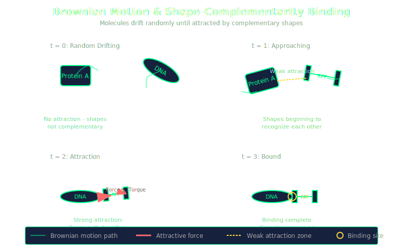
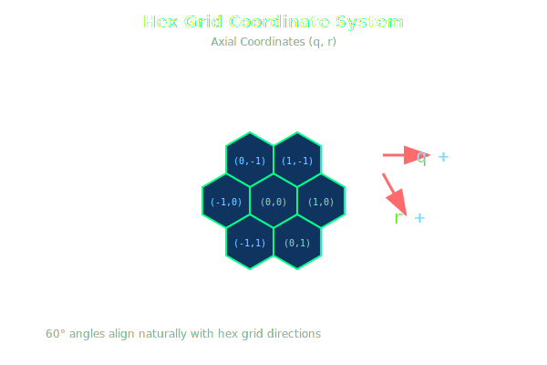

# Design Document - Prototype v2
## Major Rework: Brownian Motion & Hex-Based Molecules

### Core Design Philosophy

**Sandbox Mechanics Over Scripted Puzzles**
- Inspired by **Shapez**, **Factorio**, and **Opus Magnum**
- Focus on creating robust, interesting mechanics
- Let complexity and challenges emerge naturally from the mechanics
- Players discover their own solutions and optimizations
- Open-ended goals rather than prescribed solutions

**The Meta-Loop: Proteins ARE the Machines**
- **Central concept:** The proteins produced by translation fold into specific shapes
- **These folded proteins become the functional machines** that enable:
  - Transcription (RNA polymerase)
  - Translation (ribosomes)
  - Modifications (enzymes, chaperones)
  - All other biological processes
- **Bootstrap solution:** Players start with two essential proteins:
  1. **RNA Polymerase (transcription machine):** Locks onto DNA, transcribes it into RNA
  2. **Ribosome (translation machine):** Takes any RNA sequence, translates it into amino acid sequence/protein
- **Self-sustaining system:** Use these starter proteins to build more/better proteins
- **Emergent complexity:** The "machines" in your factory are the products of your factory

**Energy System: ATP as Currency**
- **ATP (Adenosine Triphosphate):** Universal energy currency for active processes
- **Active processes require ATP:**
  - **Transcription:** Each nucleotide added to RNA costs ATP (1+ per step)
  - **Translation:** Each amino acid added to protein costs ATP (1+ per step)
  - Other energy-requiring reactions
- **Passive processes are free:**
  - **Binding:** Shape-complementarity attraction (no ATP)
  - **Folding:** Thermodynamic process driven by amino acid properties (no ATP)
  - **Brownian motion:** Natural random movement (no ATP)
  - **Heat dissipation:** Passive diffusion (no ATP)
- **ATP management becomes resource constraint:**
  - Must produce/acquire ATP to sustain active processes
  - Running out of ATP halts transcription/translation
  - Like power in Factorio or oxygen in ONI
  - Creates optimization challenge: energy efficiency vs. throughput

**Starting State:**
- Player begins with:
  - 1+ RNA Polymerase proteins (enables DNA → RNA)
  - 1+ Ribosome proteins (enables RNA → Protein)
  - Some initial DNA sequences (genetic "blueprints")
  - **Initial ATP supply** (or ATP generation mechanism)
- Goal: Use these to bootstrap production of new proteins with new functions
- New proteins can improve or replace the starter proteins
- Must manage ATP production to sustain operations

**Key Inspirations:**
- **Shapez**: Simple building blocks → complex emergent systems
- **Factorio**: Logistics, throughput optimization, scaling production, **recursive production chains**
- **Opus Magnum**: Spatial programming, elegant mechanical solutions
- **Oxygen Not Included**: Deep thermodynamic simulation, heat management, cascading system failures

**Design Approach:**
1. Build solid core mechanics (molecular motion, protein folding, mechanical interactions)
2. Provide tools and constraints
3. Let players experiment and optimize
4. Challenges arise from the system itself, not artificial puzzle constraints

#### 1. Molecular Movement System



**Brownian Motion Simulation**
- DNA, RNA, and proteins float freely in 2D space
- Position slowly random walks (Brownian motion)
- Orientation slowly random walks (rotational Brownian motion)
- Creates dynamic, organic feel to molecular interactions

**Shape-Complementarity Binding System**
- **Binding partners:** Proteins can bind to:
  - Other proteins
  - DNA strands
  - RNA strands
  - Possibly strand-to-strand pairing
- **Attraction mechanism:** When two molecules have complementary shapes:
  - They feel an attractive **force** (pulling them together)
  - They feel a **torque** (rotating them to align)
  - Strength of force/torque increases with shape similarity
- **Speed-Heat-Error Tradeoff:**
  - **More similar shapes** → **faster binding**
  - **Faster binding** → **more heat generated** (possibly unwanted side effect)
  - **Faster binding** → **higher error rate** (chance to get stuck in invalid/incorrect configurations)
  - Creates interesting optimization: speed vs. accuracy
  
**Thermodynamic System (inspired by Oxygen Not Included):**
  - **Heat generation:** All molecular processes generate heat (some more than others)
    - Binding events produce heat
    - Failed bindings produce heat
    - Transcription/translation produce heat
    - Different reactions have different heat profiles
  - **Passive heat dissipation:** Heat gradually radiates away via diffusion
  - **Active heat transport (key mechanic!):**
    - **Heat capacity proteins:** Special proteins that can store large amounts of heat
    - **Conformational switching:** As they absorb heat, probability of conformational change increases
    - **Heat shuttle cycle:**
      1. Cool conformation near hot process → absorbs heat
      2. Gets hot → undergoes conformational change
      3. New shape is attracted to distant "heat sink" molecule
      4. Travels to heat sink, dumps heat
      5. Cools down → refolds to original conformation
      6. Original shape attracted back to hot zone
      7. Cycle repeats
    - **Active cooling:** Removes heat faster than diffusion alone
    - **Player-designed:** Players must build/position these heat transport proteins
  - **Heat transfer:** Heat conducts between adjacent molecules/regions
  - **Temperature effects:**
    - **Too hot:** Proteins denature (unfold), reactions speed up but error rates spike
    - **Too cold:** Reactions slow down, Brownian motion decreases
    - **Optimal range:** Different proteins have different temperature optima
  - **Cascading failures:** Hot spot can spread and denature entire protein chains
  - **Strategic cooling:** Position heat-capacity proteins, design heat shuttle systems
- **Binding lock:** Once two structures successfully bind:
  - No other structures are attracted to either of them
  - Binding is exclusive (prevents multi-binding confusion)
  - Bound complex moves as a single unit

**Implications:**
- Machines must "catch" molecules as they drift by (or attract them via shape)
- Timing becomes important - wait for the right orientation
- More realistic molecular behavior
- Heat management could be a resource/constraint
- Error correction mechanisms could be valuable proteins to build

#### 2. Molecular Representation System



**Hex Grid Local Structure**
- All molecules (DNA, RNA, proteins) are built on hex grid principles
- Each hex contains one component (nucleotide or amino acid)
- Molecules consist of straight segments with 60° or 120° turns
- Locally hex-based, but float freely in continuous space

#### 3. DNA Structure


**Double Helix → Double Strand (no helix in game)**
- Two parallel strands with complementary base pairs
- One hex gap between strands (middle row has linkage symbols)
- Gap contains X-shaped symbols showing hydrogen bonding
- Each strand mostly straight, occasional 60° corners allowed
- Both strands conform to hex grid alignment
- **Directionality is critical and must be displayed**

**Visual Representation:**
```
3'-<A>-<C>-<G>-<T>-5'  (top strand, left to right = 3' to 5')
   | | ||| ||| | |     (hydrogen bonds: | | for A-T, ||| for G-C)
5'-<T>-<G>-<C>-<A>-3'  (bottom strand, left to right = 5' to 3')

Example with complementary pairing:
- Top: A-C-G-T (reading 3' → 5')
- Bottom: T-G-C-A (reading 5' → 3')
- Base pairing: A-T (2 bonds), C-G (3 bonds), G-C (3 bonds), T-A (2 bonds)
- Hydrogen bonds shown vertically between paired bases
```

**Critical Details:**
- **Top strand:** 3' to 5' direction (left to right)
- **Bottom strand:** 5' to 3' direction (left to right)  
- **Directionality labels:** Show "3'" and "5'" at the ends of both strands
- **Middle row hexes:** X-shaped linkage symbols (representing hydrogen bonds)
- **Complementary pairing:** A↔T (2 H-bonds), G↔C (3 H-bonds)

**Constraints:**
- Strands maintain exactly one hex spacing (middle row between them)
- Complementary pairing enforced (A-T, G-C)
- Can have 60° bends while maintaining structure
- Both strands must remain on hex grid
- Antiparallel orientation always maintained (one strand 5'→3', other 3'→5')

#### 4. RNA Structure
- Single strand only (no double helix)
- Sequence of A, C, G, U on hex grid
- Each nucleotide occupies one hex
- **No cross-links** (unlike DNA)
- Can bend at **60° angles only** (not 120°)
- Similar visual style to DNA strands but without the complementary pairing

**Visual Representation:**
```
5'-<A>-<C>-<G>-<U>-<A>-3'  (straight segment)

Or with 60° bend:
5'-<A>-<C>-<G>
             \
             <U>
               \
               <A>-3'
```

**Constraints:**
- Single continuous strand
- No linkage symbols (no double helix partner)
- 60° turns allowed between adjacent nucleotides
- 120° turns NOT allowed (would be too sharp/unrealistic)
- Must remain on hex grid
- Directional labels: 5' and 3' at ends

#### 5. Protein Structure & Folding


**Linear Structure (unfolded):**
- Single strand (like RNA)
- Sequence of amino acids (not nucleotides)
- **Amino acids added linearly by ribosome** (straight chain initially)
- **Folding begins after leaving ribosome**
- Each amino acid occupies one hex
- Different visual representation per amino acid type
- Directional labels: N-terminus and C-terminus at ends

**Amino Acid Types (Game Design Properties):**


*Structural amino acids (control folding):*
1. **Straight (STR):**
   - No bending preference, maintains linear structure

2. **Left-60 (L60):**
   - Wants to bend at 60° to the left
   - Creates expanding/spreading structures

3. **Right-60 (R60):**
   - Wants to bend at 60° to the right
   - Creates compact/tighter structures

4. **Left-120 (L12):**
   - Wants to bend at 120° to the left (sharp turn)
   - Creates expanding structures
   - Example: N-STR-L12
                      \
                       BTA (bends using /)

5. **Right-120 (R12):**
   - Wants to bend at 120° to the right (sharp turn)
   - Creates compact structures
   - Example: N-STR-R12
                      /
                       BTA (bends using \, opposite of L12)

6. **Flexible (FLX):**
   - No folding preference
   - Low energy barriers, easily bends in any direction

*DNA/RNA-binding amino acids (sequence recognition):*

7. **Bind-A (BTA):** 
   - Straight line
   - Wants to bond to A nucleotide in DNA/RNA

8. **Bind-C (BTC):** 
   - Straight line
   - Wants to bond to C nucleotide in DNA/RNA

9. **Bind-G (BTG):** 
   - Straight line
   - Wants to bond to G nucleotide in DNA/RNA

10. **Bind-T (BTT):** 
   - Straight line
   - Wants to bond to T nucleotide in DNA

*Mechanical amino acids (manipulation):*

11. **Curl (CRL):** 
    - After binding to DNA/RNA, causes the nucleic acid to curl/bend towards it
    - Enables DNA/RNA manipulation during transcription/translation

*Catalytic amino acids (transcription & translation):*

12. **RNA-Polymerase-Function (RPF):** 
    - Catalyzes RNA synthesis during transcription (DNA → RNA)
    - Must be bound to function (positioned by protein fold)
    - Adjacent to DNA codon(s): Reads template strand
    - No RNA codons adjacent: Only adds RNA when position is clear
    - Action: Places new RNA codon in first open hex location clockwise from last DNA codon
    - Complementarity: New RNA codon is complementary to DNA codon(s)
      - If multiple DNA codons adjacent, matches at least one
      - Best practice: Position RPF next to exactly one DNA codon for specificity
    - Chain extension: If existing RNA codon immediately before open location, new codon attaches to it (continues chain)
    - Consumes ATP per nucleotide added

13. **Peptide-Bond-Former (PBF):** 
    - Catalyzes protein synthesis during translation (RNA → Protein)
    - Must be bound to function (positioned by protein fold)
    - Adjacent to RNA codon(s): Reads mRNA sequence
    - Other side adjacent to nothing OR one hex away from growing protein chain
    - Action: Adds amino acid corresponding to RNA codon to the protein chain
    - Codon reading: Translates RNA triplets into amino acids (genetic code)
    - Chain extension: New amino acid attaches to growing protein chain
    - Consumes ATP per amino acid added
    - This is the core catalytic site of the ribosome

**Folding Mechanics:**
- Proteins fold based on amino acid sequence "preferences"
- Each amino acid type exerts forces/torques on the chain
- **No self-overlap allowed** (2D constraint enforced during folding)
- Folding is deterministic based on sequence
- Moment of inertia direction determines expand vs. compact behavior
- Multiple competing forces resolve into stable fold
- Folded shape determines protein function

**Functional Proteins (Folded):**
- **RNA Polymerase:** Contains RPF amino acid(s), DNA-binding amino acids recognize promoter sequences, curl amino acids manipulate DNA during transcription
- **Ribosome:** Contains PBF amino acid(s), RNA-binding amino acids grab mRNA, complex fold that outputs linear protein chains
- **Enzymes:** Catalyze specific reactions (e.g., join molecules, split molecules)
- **Heat shuttles:** Conformational switching between two stable states
- **Chaperones:** Assist in folding other proteins
- **Modifiers:** Add/remove chemical groups (phosphorylation, etc.)

**Example Protein Design:**
```
Simple transcription factor:
N-STR-STR-BTA-BTT-CRL-L60-L60-STR-C

This protein would:
- Start straight (STR-STR)
- Have DNA binding sites (BTA-BTT) that recognize AT sequence
- Have curl mechanism (CRL) to bend DNA
- Bend left (L60-L60) to create binding pocket
- End straight (STR)

Result: Binds AT-rich DNA and bends it (but doesn't transcribe - no RPF)

Visual example with bends AT amino acids (not in gaps):
N-STR-L60
        \
        BTA
          \
          STR-C

The \ occurs AT the L60 and BTA amino acids (60° bend),
not in the gaps between them.
```

RNA Polymerase (simplified example):
N-L60-BTA-BTG-RPF-CRL-BTA-BTT-STR-STR-C

This RNA polymerase would:
- Left bend structure (L60) to create channel
- DNA binding sites (BTA-BTG-BTA-BTT) to recognize promoter and position template strand
- RPF catalytic site reads DNA and synthesizes complementary RNA
- CRL manipulates DNA during transcription
- Creates RNA strand from DNA template (consumes ATP per nucleotide)

Ribosome (simplified example):
N-L60-L60-PBF-R60-STR-STR-C

This ribosome would:
- Create binding channel with left bends (L60-L60)
- Have catalytic site (PBF) that reads mRNA codons and adds amino acids
- Right bend (R60) to create stable core
- The PBF reads codons and extends the growing protein chain (consumes ATP per amino acid)
- Note: Removed BU (Bind-U) amino acids since we no longer have that type
```

**Constraints:**
- Single continuous chain
- Both 60° and 120° turns allowed (unlike RNA which only allows 60°)
- Must remain on hex grid
- **Cannot self-overlap** (2D game constraint)
- Folding driven by amino acid properties

### Technical Implementation Notes

**Hex Grid Math:**
- Use axial or cube coordinates for hex positioning
- 60° angles = natural hex grid directions
- Need conversion between hex-local coords and world space coords

**Brownian Motion:**
- Position: Add small random vector each frame
- Rotation: Add small random angle each frame  
- Damping factor to prevent runaway motion
- Configurable "temperature" = motion intensity

**Collision/Interaction:**
- Molecules need bounding boxes for machine interactions
- Hex-aligned hitboxes?
- When does a machine "grab" a floating molecule?

### Questions to Resolve (Mechanics-Focused)

**Energy System (ATP):**
1. **ATP production:** How do players generate ATP? Starting supply? ATP synthase proteins?
2. **ATP consumption rates:** Exact cost per transcription/translation step? Variable costs?
3. **ATP storage:** Is there a limit? Can ATP be stockpiled?
4. **ATP visualization:** How to show ATP levels, consumption, production rates?
5. **Energy crisis:** What happens when ATP runs out? Gradual slowdown? Complete halt?
6. **Energy efficiency:** Can players build more efficient polymerases/ribosomes that use less ATP?
7. **Energy optimization:** Tradeoff between speed (high ATP use) and efficiency (low ATP use)?

**Molecular Physics:**
1. **Brownian motion speed:** How fast should molecules drift? Balance between dynamic and playable
2. **Collision behavior:** What happens when molecules bump into each other (not complementary)?
3. **Molecule spawning:** Continuous flow? Player-controlled? Resource management?
4. **Binding radius:** At what distance does shape-complementarity attraction activate?
5. **Force strength:** How strong is the attractive force? Does it overpower Brownian motion completely?

**Shape-Complementarity System:**
1. **Shape matching algorithm:** How do we determine if two shapes are complementary?
2. **Partial matches:** Can shapes be "somewhat" complementary? Gradient of attraction?
3. **Strand pairing:** Can DNA-DNA or RNA-RNA bind via complementary sequences?
4. **Visual feedback:** How do we show attraction forces, heat, and binding in progress?

**Thermodynamics (ONI-inspired):**
1. **Heat generation rates:** How much heat per binding event? Per failed binding? Per transcription/translation?
2. **Heat capacity:** Do different molecules store heat differently? How much can heat-capacity proteins hold?
3. **Heat transfer:** Conduction rates between molecules? Does empty space insulate?
4. **Passive diffusion rate:** How fast does heat radiate away naturally?
5. **Conformational change probability:** How does temperature map to probability of switching?
6. **Heat shuttle design:** 
   - What shapes attract to hot zones vs. cold zones?
   - How much heat can one shuttle protein transport per cycle?
   - Speed of shuttle travel?
7. **Denaturation:** At what temperature do proteins unfold? Is it reversible?
8. **Heat sink molecules:** What do shuttle proteins dump heat to? Just empty space? Special molecules?
9. **Temperature gradients:** How do hot/cold zones form and spread?
10. **Visual feedback:** How to show temperature, heat capacity, conformational states?

**Protein Folding:**
1. **Folding simulation:** How do competing forces from different amino acids resolve? Physics-based? Energy minimization?
2. **Folding speed:** Does folding happen instantly, or animate over time?
3. **Moment of inertia calculation:** How do we compute this for determining expand vs. compact direction?
4. **Force strength:** How strong is each amino acid's preference? Do they have different strengths?
5. **Conflict resolution:** What if amino acids want contradictory bends? (e.g., E60 next to C60)
6. **No self-overlap:** How do we enforce this during folding? Block invalid folds? Force resolution?
7. **Stability:** Are folds permanent once formed? Can proteins refold? Unfold under stress?
8. **Visual feedback:** How do we show folding in progress, forces, conflicts?
9. **Player control:** Can players manually adjust folds, or is it purely deterministic?
10. **DNA/RNA binding:** When multiple Bind-X amino acids exist, how do they collectively recognize sequences?
11. **Curl mechanics:** How much does CRL bend DNA/RNA? Fixed angle or variable?
12. **RPF transcription mechanics:** 
    - How does "first open hex location clockwise" work precisely?
    - What if there are multiple valid positions?
    - Speed: One nucleotide per cycle? Slower?
13. **PBF translation mechanics:** 
    - How does PBF "read" adjacent codon to determine which amino acid to add?
    - Codon table: Real genetic code or simplified mapping?
    - Spatial constraints: Exactly one hex away or flexible?
    - Does growing chain need to be fed through specific geometry?
    - How do multiple adjacent RNA codons get selected?

**Protein-as-Machine Mechanics:**
1. **Interaction range:** How do folded proteins detect and act on molecules?
2. **Catalysis:** How do enzyme proteins speed up or enable reactions?
3. **Specificity:** How do we ensure proteins only interact with correct targets?
4. **Degradation:** Do proteins wear out? Need to be replaced?
5. **Positioning:** Can players manually position proteins, or do they drift with Brownian motion too?

**Transcription/Translation Mechanics:**
1. **RNA Polymerase (protein):** How does it mechanically unzip DNA and produce RNA?
2. **Ribosome (protein complex):** How does it read mRNA codons and produce proteins?
3. **Strand separation:** How does DNA unzip during transcription?
4. **Complementary pairing:** Automatic or requires specific protein catalysis?
5. **Directional constraints:** How do 3'→5' / 5'→3' directions affect mechanics?
6. **Codon reading:** Real genetic code or simplified?

**Throughput & Optimization:**
1. **Multiple molecules:** How many can be in flight simultaneously?
2. **Timing challenges:** Molecules arriving at different times
3. **Bottlenecks:** What creates interesting optimization problems?
4. **Scaling:** How does complexity scale with production requirements?
5. **Recursive production:** How to build proteins that build better proteins?

### Next Steps

- Decide on answers to open questions
- Prototype hex grid rendering system
- Implement Brownian motion physics
- Build molecule class system (DNA, RNA, Protein)
- Test interaction with v1's machine placement system

### Future Ideas (Post-v2)

- RNA secondary structure (hairpin loops, etc.)
- Protein folding mechanics
- More complex DNA structures (supercoiling?)
- Molecule-molecule interactions (hybridization, binding)
- Multiple molecules on screen simultaneously

---

**Status:** Design phase - awaiting additional ideas before implementation
